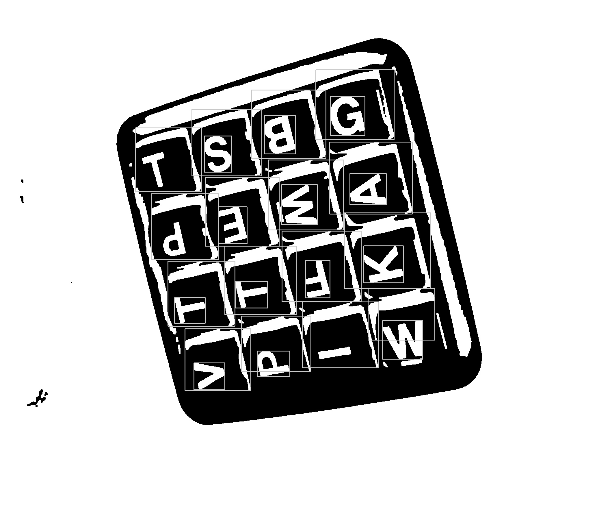
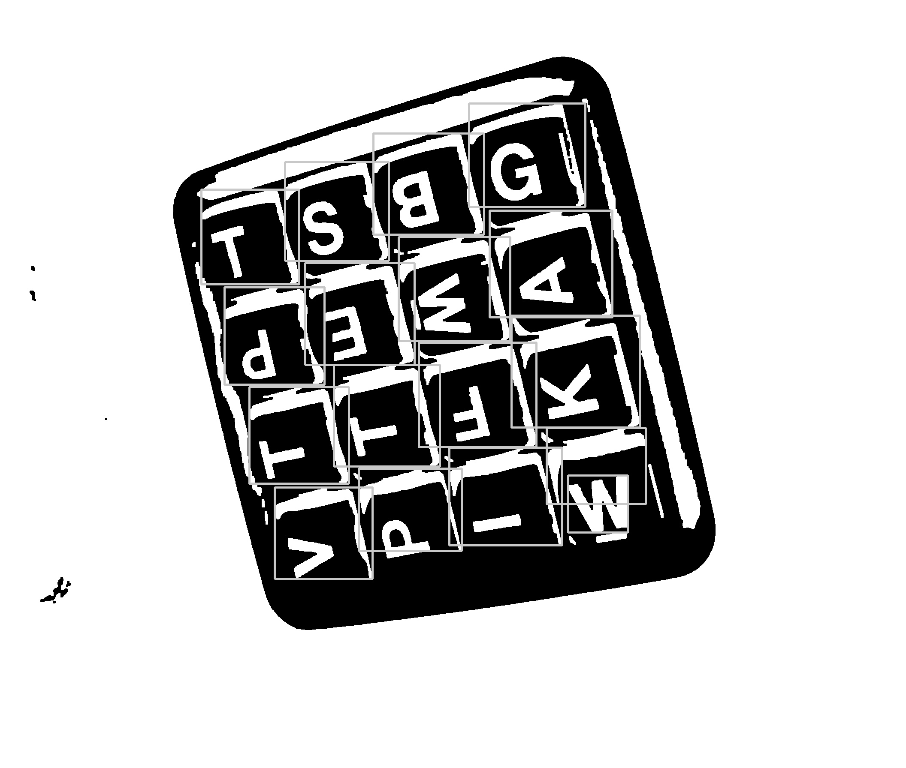
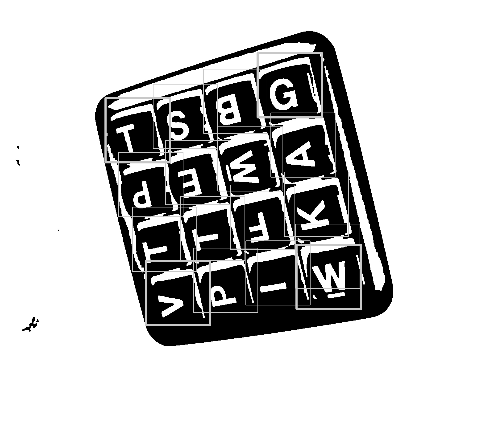
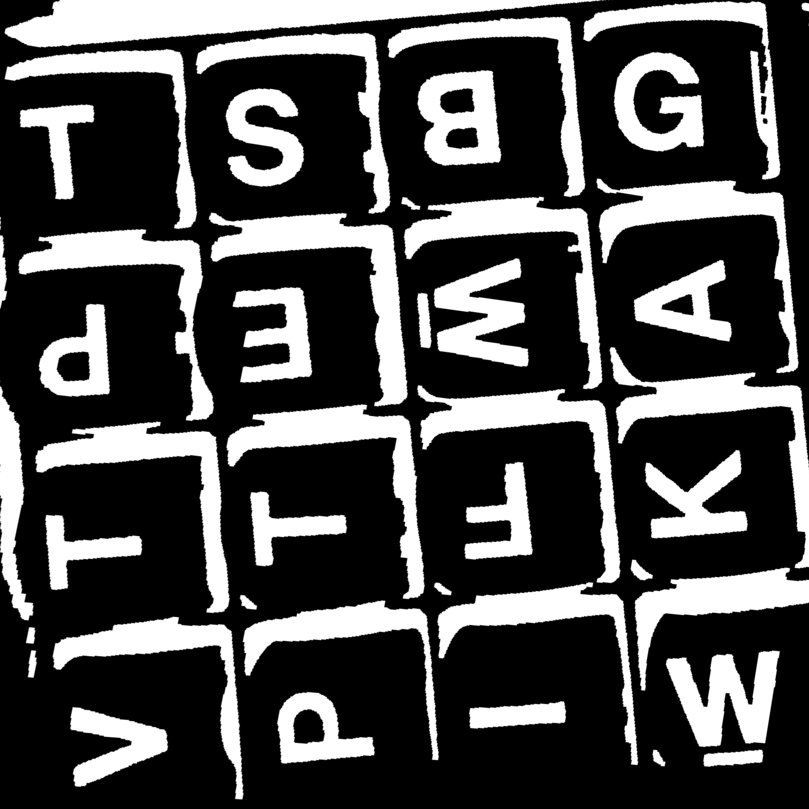
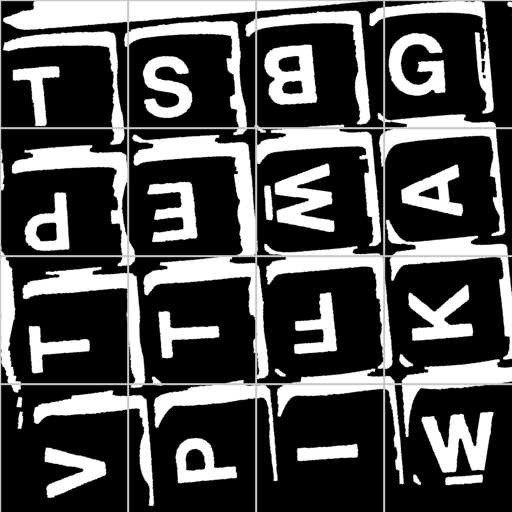
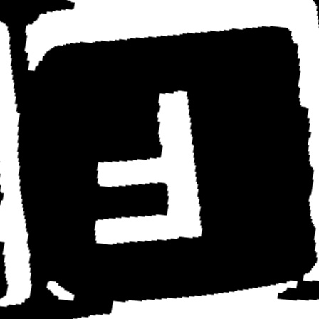

# Extracting boggle board text from images

## Image processing

The image processing and segmentation pipeline takes an RGB image and generates
perspective corrected B+W sub-images for each boggle cube. You can run it with

    boggler seg

Our input image looks like this:

This is a pretty bad input: skewed, and only filling ~60% of the frame width. Hopefully our 
users can do better, but this is a good starting point.

And our desired output of the feature extraction step is something like this for each cube:

### Preprocessing

First we convert to grayscale

Then we invert the image

Then we threshold to binary BW

Then we perform an "expand" (expanding the white regions) followed by a "contract" (contracting
the white regions) to clean up the noise just a little bit. 

See https://docs.opencv.org/master/d9/d61/tutorial_py_morphological_ops.html for more details

### Cube detection

The first step in cube detection is finding the bounding boxes with cv.findContours(). We only consider
bounding boxes within a given size range.

As you can see, there are some overlapping bounding boxes. We remove duplicates using cv.groupRectangles

Not perfect, but it'll do for now. We then find the median bbox edge length, and force all bounding boxes
to be squares of this size:

### Skew correction and gridding

Now we need to correct for perspective and rotation. To do this, we find the outside corners of the
set of bounding boxes (shown in bold lines below)

And use cv.wrapPerspective to make a new square image (with dimensions based on the shorter of the two 
dimensions of the input image) containing only our boggle board:

Then, using the number of pruned bounding boxes, we guess at the board size (4, 5, or 6x6 boggle)
 and gridify the reshaped image:

Finally, we extract the individual grid cells and write them as images in `debug/{img_number}/img_feat_{y}{x}.jpg`

## Data labeling

OK, we have a bunch of clean-ish images of characters. Now it's time to generate some ground truth
training and evaluation data for our model.

To run annotation on a set of features, first copy the features into the `groundtruth` directory, then run

    boggler annotate

This will display each image from a recursive traversal of `groundtruth/*`, waiting for a keypress. Press the key corresponding to the
letter on the cube. Use lowercase letters for normal (single-letter) cubes, "E" for the "Er" cube,
"q" (lowercase) for the "Qu" cube, "!" for the "black box" cube (6x6 only), and "?" if you don't recognize 
the cube.

For each image `groundtruth/path/to/img.jpg`, the annotation will be written to `groundtruth/path/to/img.label`.

You should probably split images into train, dev, and test images, and put each of them in a subdirectory
of `groundtruth`.

### Character classification

## Model Training

## Inference

still not sure how I'm going to do this 